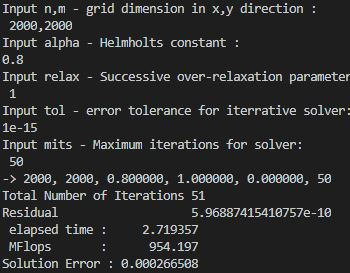
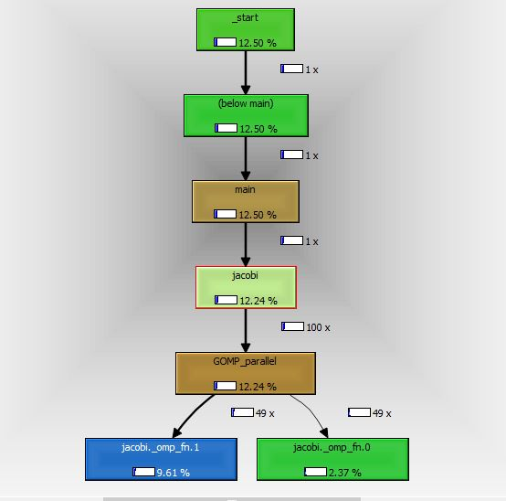
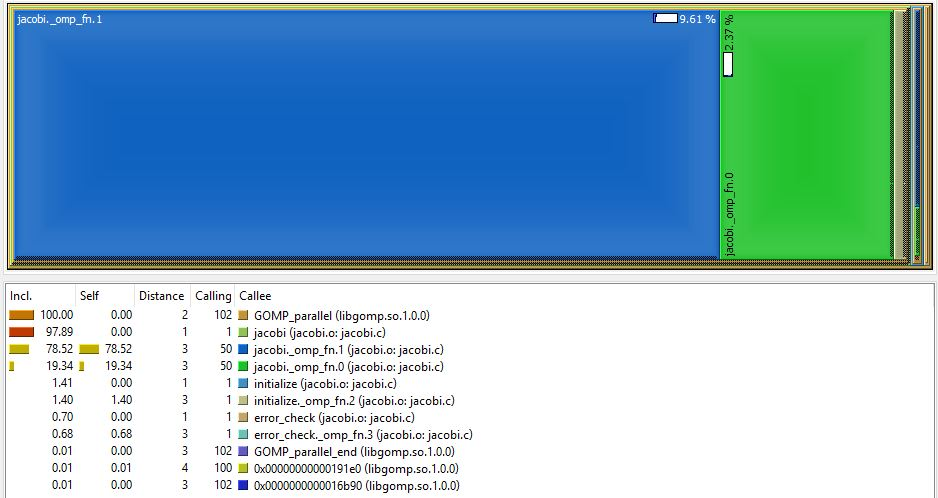

# HelmholtzOpenMP
Paralelización del código para la solución numérica de la ecuación de Helmholtz

## Perfilamiento ## 

Para el ejercicio de perfilamiento se utilizó la herramienta <a href="https://sourceforge.net/projects/qcachegrindwin/">kcachegrind</a> Los archivos que fueron insumo para kcachegrind se generaron con valgrind mediante el comando: <i>valgrind --tool=callgrind ./jacobi.o</i>
 
 
<b>Resultados del perfilamiento:</b> 
<table>
<tr valign="bottom">
<td>
 
<i>fig. 1. Call Graph</i>
</td>
<td>
 
<i>fig. 2. Callees</i>
</td>
</tr>
</table> 

Como se puede observar en la <i>fig. 2.</i> el 98.12% de las llamadas se hicieron mientras el algoritmo
se encontraba en la función <i>jacobi</i>. Esta será la función donde concentraremos la mayor parte
del esfuerzo de optimización.

## Optimización ## 
<b>Resultados de ejecución inicial:</b>  
 
<i>fig. 3. Resultados de ejecución sin optimización</i>
 

<b>Técnica de optimización:</b> 

La principal optimización se realizó sobre el método jacobi, específicamente en el segundo for anidado dentro del while. Allí se aplicó el patrón tiling con el objetivo de disminuir el número de cache misses al momento de obtener datos de nuestro array bidimensional. El tamaño del tile para las filas se calculó con base en la línea de caché [1], mientras el tamaño tile de las columnas se dejó en 1 (se probaron otros tamaños, pero el mejor resultado fue con un tamaño de 1). Dado que cada iteración del ciclo anidado sumaba sus resultados a una variable compartida, también se utilizó la directiva <i>reduction</i> de OpenMP. Por otra parte, en cada iteración se propone ejecutar dos veces el cálculo (con índices i y i+1) con el objetivo de hacer un mejor uso de las unidades aritméticas que pueda tener cada procesador [2]. Finalmente, se aplicaron otras optimizaciones sobre otras regiones principalmente con la directiva <i>collapse</i> para mejorar la distribución de las iteraciones en ciclos anidados.   

## Resultados ## 

<table>
    <thead>
        <tr>
            <th># threads</th>
            <th>elapsed time</th>
            <th>MFlops</th>
            <th>Speedup</th>
            <th>Efficiency</th>
        </tr>
    </thead>
    <tbody>
        <tr>
            <td>Secuencial</td>
            <td>2.832</td>
            <td>916.105</td>
            <td>N/A</td>
            <td>N/A</td>
        </tr>
        <tr>
            <td>2</td>
            <td>1.546</td>
            <td>1677.95</td>
            <td>1.832</td>
            <td>0.916</td>
        </tr>
        <tr>
            <td>4</td>
            <td>1.088</td>
            <td>2384.78</td>
            <td>2.603</td>
            <td>0.651</td>
        </tr>
        <tr>
            <td>8</td>
            <td>0.984</td>
            <td>2635.92</td>
            <td>2.878</td>
            <td>0.360</td>
        </tr>
        <tr>
            <td>16</td>
            <td>0.871</td>
            <td>2977.52</td>
            <td>3.248</td>
            <td>0.203</td>
        </tr>
    </tbody>
</table>
<i>tabla 1. Tiempos de ejecución vs número de hilos</i> 
 
<b>Perfilamiento luego de la optimización:</b> 
<table>
<tr valign="bottom">
<td>
 
<i>fig. 4. Call Graph después de la optimización</i>
</td>
<td>
 
<i>fig. 5. Callees después de la optimización</i>
</td>
</tr>
</table>

## Conclusiones ## 

<ul>
    <li>
        El perfilamiento nos ayuda a entender mejor cuáles son las regiones del código que requieren atención por su alto nivel de procesamiento.
    </li>
    <li>
        El patrón <i>tiling</i> es de gran utilidad cuándo tenemos procesamiento sobre arrays multidimensionales, sin embargo, siempre es muy importante definir un buen tamaño del tile para evitar al máximo los cache misses.
    </li>
    <li>
        La directiva <i>collapse</i> de OpenMP nos ayuda a distribuir mejor las iteraciones a cada hilo cuando tenemos ciclos anidados.
    </li>
</ul>

## Referencias ## 

<ul>
    <li>
        <a href="https://www.sciencedirect.com/topics/computer-science/loop-tiling">
            <i>
            [1]	A. Duran and L. Meadows, “A Many-Core Implementation of the Direct N-Body Problem,” in High Performance Parallelism Pearls: Multicore and Many-core Programming Approaches, Elsevier Inc., 2015, pp. 159–174.
            </i>
        </a>
    </li>
    <li>
        <a href="https://m-sp.org/downloads/pp_report_openmp.pdf">
            <i>
            [2]	M. Springer, “Practical Parallel Computing, Assignment 1-Diffusion.”
            </i>
        </a>
    </li>
</ul>
