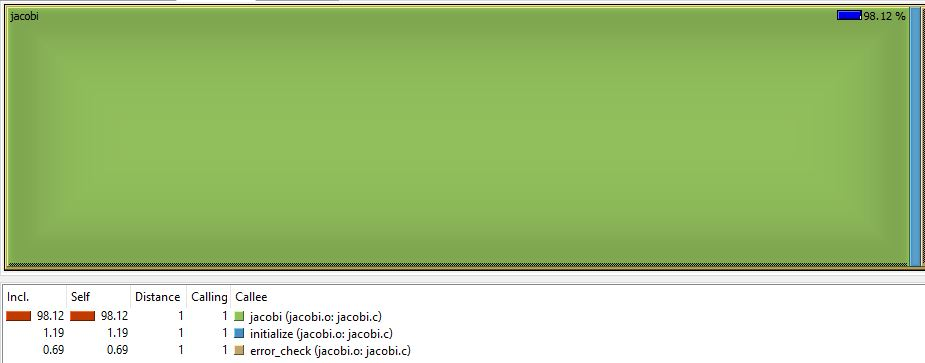

# HelmholtzOpenMP
Paralelización del código para la solución numérica de la ecuación de Helmholtz

## Perfilamiento ## 

Para el ejercicio de perfilamiento se utilizó la herramienta <a href="https://sourceforge.net/projects/qcachegrindwin/">kcachegrind</a> Los archivos que fueron insumo para kcachegrind se generaron con valgrind mediante el comando: <i>valgrind --tool=callgrind ./jacobi.o</i>
 
 
<b>Resultados del perfilamiento:</b> 
<table>
<tr valign="bottom">
<td>
 
<i>fig. 1. Call Graph</i>
</td>
<td>
 
<i>fig. 2. Callees</i>
</td>
</tr>
</table> 

Como se puede observar en la <i>fig. 2.</i> el 98.12% de las llamadas se hicieron mientras el algoritmo
se encontraba en la función <i>jacobi</i>. Esta será la función donde concentraremos la mayor parte
del esfuerzo de optimización.